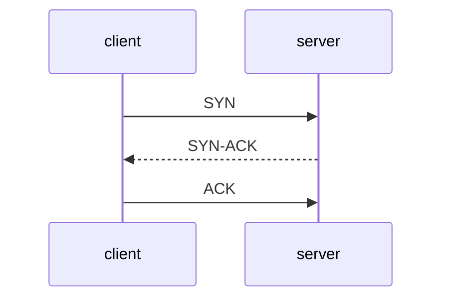

네트워크 상에서 두 노드가 데이터 주고 받기 위해 정의한 규칙을 프로토콜이라 한다. TCP/IP 모델에는 4개의 계층이 있다.
- 애플리케이션 계층
	- HTTP, FTP, SMTP
- 전송 계층
	- TCP, UDP
- 네트워크 계층
	- IP
- 데이터 링크 계층
- 물리 계층
개발자는 주로 전송 계층과 애플리케이션 계층의 프로토콜을 쓴다. 전송 계층에서 쓰는 프로토콜로 TCP, UDP. 이들은 각각 안정성과 속도에 중점.

## TCP
Transmission Control Protocol은 연결 기반 프로토콜. 두 노드 간에 연결을 먼저 맺은 뒤 데이터를 주고 받는다. TCP에서 두 노드가 연결을 맺기 위한 과정을 3-Way Handshake 라 부른다.

TCP의 장점은 신뢰성. TCP는 패킷 순서를 보장하고 패캣이 유실될 경우 재전송하는 기능 제공하여 안정적으로 데이터 전송 가능. 이런 이유로 애플리케이션 계층의 HTTP, SMTP 같은 많은 프로토콜이 TCP 기반으로 동작함.

TCP가 전송을 보장하기 위해 사용하는 시퀀스 번호, 확인 응답, 재전송 등이 추가되면서 전송속도는 UDP 대비 느리다. 예를 들어 일부 패킷이 유실되면 해당 패킷이 도착할 때까지 이후 패킷 제대로 처리 못하는 HOL Blocing(Head-of-Line Blocking)문제가 있는데 전체적인 전송속도를 저하시킨다.

## UDP
응답 확인이나 패킷 정렬같은거 안해서 전송속도가 TCP 대비 빠름. 이런 이유로 UDP는 속도가 중요하거나 일부 데이터가 유실되더라도 문제되지 않는 통신에 주로 사용. UDP 사용 예로는 DNS, VolP, Game등
## QUIC
TCP는 신뢰성있지만 느리고 UDP는 빠르지만 신뢰성이 없다. 이 둘은 합쳐 빠르면서 신뢰성 있는 프로토콜이 있으면 얼마나 좋을까? 이런 목적으로 개발된 프로토콜이 바로 QUIC.

QUIC는 UDP 기반. TCP의 연결 관리 기능은 QUIC 프로토콜 수준에서 제공. 예를 들어 QUIC 는 데이터에 ID(Connection ID)를 포함시키는데 . 이연결 ID 이용해서 두 노드간의 연결을 유지함. 또한 TCP의 혼잡 제어나 패킷 유실 복구 같은 기능을 QUIC 프로토콜 수준에서 제어한다.

QUIC는 TLS(Transport Layer Security)를 통합함. QUIC 패킷은 기본적으로 암호화되어 전송된다. 또 TCP 기준의 HTTPS는 TPC 연결 위한 3-way handshake와 TLS연결 위한 TLS Handshake를 진행해서 여러 차례 통신 뒤 연결이 수립되는데 QUIC는 이를 통합해서 이 과정을 단축함.

HTTP/3 프로토콜은 QUIC를 기반으로함.

![[SCR-20250729-laht.png]]
QUIC는 멀티플렉싱 지원한다. QUIC는 한 연결에서 여러 스트림을 동시에 처리 가능. 여러 스트림 동시 처리 하므로 1개의 스트림에서 HOL 블로킹 발생해도 다른 스트림에 영향 안줌. 참고로 HTTP/2 도 멀티플렉싱 지원하지만 TCP 자체에서 발생하는 HOL 블로킹 문제는 해결 못한다.

포트 번호는 부호 없는 16비트 정수 씀. 즉 2의 16제곱까지 인데 65535까지됨. 이거 때문에 저 포트개수가 한계인걸로 오해하는 경우 많음. 실제 한 장비에서 생성 가능한 TCP 연결 개수는 2의 96제곱임

TCP 각 연결은 (로컬IP, 로컬 포트, 원격IP, 원격 포트)로 구분. IP는 32비트, 포트는 16비트. 따라서 .한 장비가 가능한 연결개수는 이론적으로

`2^16 * 2^32(원격IP) * 2^16 = 2^44`

엄청 크다. 하나의 로컬IP의 1개 포트에 연결할 수 있는 TCP 연결 개수가 65,535인것.

