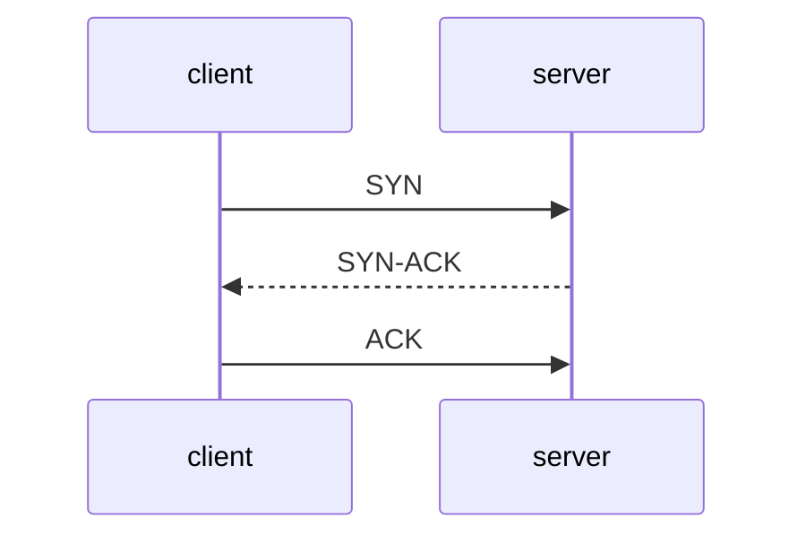

네트워크 상에서 두 노드가 데이터 주고 받기 위해 정의한 규칙을 프로토콜이라 한다. TCP/IP 모델에는 4개의 계층이 있다.
- 애플리케이션 계층
	- HTTP, FTP, SMTP
- 전송 계층
	- TCP, UDP
- 네트워크 계층
	- IP
- 데이터 링크 계층
- 물리 계층
개발자는 주로 전송 계층과 애플리케이션 계층의 프로토콜을 쓴다. 전송 계층에서 쓰는 프로토콜로 TCP, UDP. 이들은 각각 안정성과 속도에 중점.

## TCP
Transmission Control Protocol은 연결 기반 프로토콜. 두 노드 간에 연결을 먼저 맺은 뒤 데이터를 주고 받는다. TCP에서 두 노드가 연결을 맺기 위한 과정을 3-Way Handshake 라 부른다.

TCP의 장점은 신뢰성. TCP는 패킷 순서를 보장하고 패캣이 유실될 경우 재전송하는 기능 제공하여 안정적으로 데이터 전송 가능. 이런 이유로 애플리케이션 계층의 HTTP, SMTP 같은 많은 프로토콜이 TCP 기반으로 동작함.

TCP가 전송을 보장하기 위해 사용하는 시퀀스 번호, 확인 응답, 재전송 등이 추가되면서 전송속도는 UDP 대비 느리다. 예를 들어 일부 패킷이 유실되면 해당 패킷이 도착할 때까지 이후 패킷 제대로 처리 못하는 HOL Blocing(Head-of-Line Blocking)문제가 있는데 전체적인 전송속도를 저하시킨다.

## UDP
## QUIC
