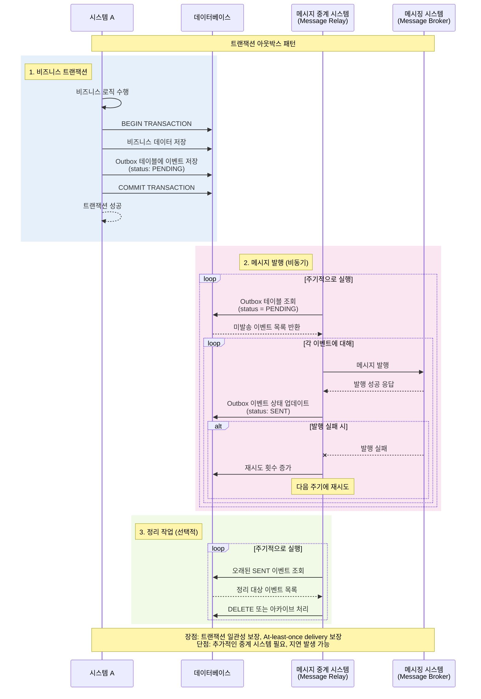

메시지 시스템 연동에 실패하는 가능성도 있기 때문에, 메시지 시스템에서 메시지 데이터가 유실되지 않도록 보장하는 방법은 바로 **메시지 데이터를 DB에 저장하는 것**. 저장 후 이 메시지를 읽어 메시징 시스템에 전송하면 된다.

이처럼, 메시지 데이터를 DB에 보관하는 방식이 ==트랜잭션 아웃박스 패턴의 핵심==

트랜잭션 아웃박스 패턴은 하나의 DB 트랜잭션 내에서 다음의 2가지 작업 수행
- 실제 업무 로직에 필요한 DB 변경 작업 수행
- 메시지 데이터를 [[아웃박스 테이블]]에 추가
아웃박스 테이블에 쌓인 메시지들을 별도의 메시지 중계 프로세스가 주기적으로 읽어서 메시징 시스템에 전송

트랜잭션을 [[롤백]]하면 메시지 데이터도 함께 롤백되므로 잘못된 데이터가 전송될 일이 없음.

발송 완료를 표시하는 방법 2가지
- 아웃박스 테이블에 발송 상태 칼럼을 두는 것
	- 이 칼럼에 3가지 상태(발송 대기, 발송 완료, 발송 실패)를 둠.
	- 발송 대기 상태를 갖는 데이터를 조회하고 발송에 성공하면 발송 완료로 업데이트하는 방식.
- 메시지 중계 서비스가 성공적으로 전송한 마지막 메시지 ID를 별도로 기록하는 방식
	- 파일이나 별도의 테이블에 메시지 ID를 저장해두고, 다음번 대기 메시지 조회시 이 ID이후의 메시지만 선택하는 것.

아웃박스 테이블 구조의 예

| 칼럼          | 타입        | 설명                                 |
| ----------- | --------- | ---------------------------------- |
| ID          | big int   | PK. auto inc                       |
| messageId   | varchar   | 메시지 ID                             |
| messageType | varchar   | 메시지 타입(LoginFailed, OrderPlaced 등) |
| payload     | clob      | 메시지의 데이터(JSON 등)                   |
| status      | varcher   | 이벤트 처리 상태(WAITING, DONE, FAILED)   |
| failCount   | int       | 실패 횟수                              |
| occuredAt   | timestamp | 메시지 발생 시간                          |
| processedAt | timestamp | 메시지 처리 시간                          |
| failedAt    | timestamp | 마지막 실패 시간                          |
