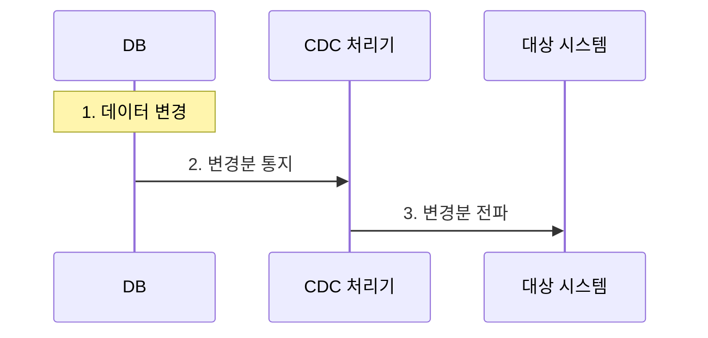
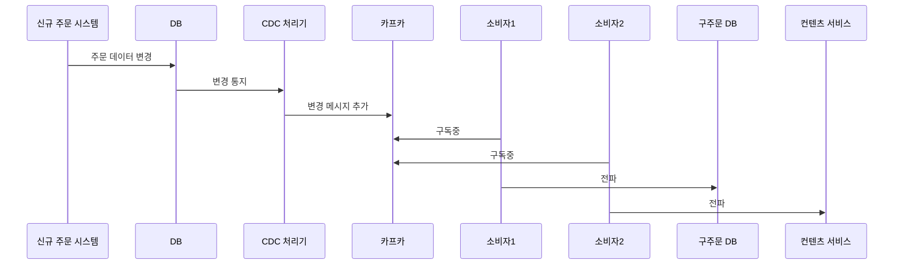

오라클, MySQL 같은 DBMS는 데이터가  변경되면 그 변경 내용을 통지하는 기능을 제공함. [[비동기 처리 기법 - CDC(change data capture)]](Change Data Capture) 패턴은 이 기능을 활용해서 구현.

위 다이어그램은 CDC 패턴의 처리흐름임.

INSERT, UPDATE, DELETE 시 DB의 데이터가 변경된다. DB는 변경된 데이터를 CDC 처리기로 전송. 이때 DB는 커밋된 데이터만 변경된 순서에 맞게 전달. CDC 처리기에는 롤백된 데이가 전달 안되는것. 또한 잘못된 순서대로 데이터가 전달도 안됨.

변경 데이터는 레코드 단위로 전달됨. 예를 들어 1개 레코드 추가하고 2개 레코드 수정한 다음 3개 레코드 삭제했다면 총 6개 레코드 변경분이 CDC 처리기에 전달. 이 변경분 데이터에는 추가, 수정, 삭제인지 구별할수있는 플래그도 포함됨.

CDC 처리기는 전달받은 변경 데이터 확인하고 가공 후 대상 시스템에 전파. 크게 2가지 형태로 대상 시스템에 변경 데이터를 전파함.
1. 변경 데이터를 그대로 대상 시스템에 전파
2. 변경 데이터를 가공/변환 해서 대상 시스템에 전파

## CDC가 유용한 케이스

특정 시스템이 복잡해서 연동 코드를 넣기 부담스러울때 CDC가 유용할 수 있다.

예를들어, 신규 주문 시스템이 새로 구축되었다 하자. 이 신규 주문 시스템에서 발생한 주문 데이터를 기존 주문 시스템에 반영해야하는 요구사항이 왔다. 이를 위해 신규 주문 시스템에서 주문이 생성되거나 변경되면 그 데이터를 기존 주문 시스템에 전달해야했음.

하지만, 신규 주문 시스템 개발팀은 연동 코드 추가에 난색을 표함. 시간 문제, 복잡한 코드에 연동 코드 추가 부담등 때문. 이때 CDC를 도입!

다음은 신규 주문시스템의 코드 수정 않고 CDC이용해서 변경된 데이터를 관련 시스템에 전파한 예시 다이어그램

