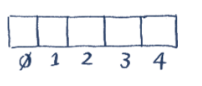
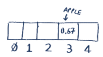
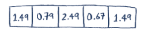
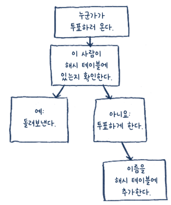
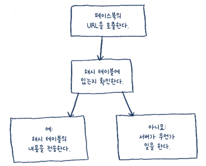
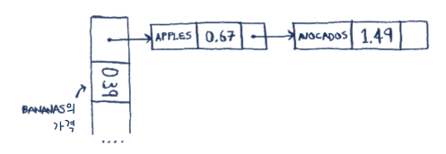
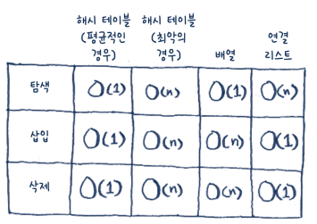

## Hash Table

## 해시 함수

해시 함수는 문자열(임의 데이터, 바이트 열)을 받아서 숫자를 반환하는 함수. 즉, 해시 함수는 문자열에 대해 숫자를 할당(mapping)한다.

해시 함수는 다음과 같은 요건을 갖추어야 한다
- 해시 함수에는 일관성이 있어야 한다.
  - 예를 들어, '사과'를 넣었을 때 '4'를 반환한다면 '사과'를 넣을 때마다 반환되는 값은 항상 '4'여야 함.
- 다른 단어가 들어가면 다른 숫자가 나와야 한다. 
  - 예를 들어, 어떤 단어를 넣어도 '1'이 나온다면 좋은 해시 함수가 아님. 가장 좋은 경우는 서로 다른 단어에 대해 서로 다른 숫자가 나오는 것

**해시 함수는 문자령에 대해 숫자를 할당(mapping)하는 것**

## 해시 테이블
해시 함수와 배열을 응용

(1) 빈 배열

(2) apple을 해시 함수에 넣고 3을 출력

(3) 3을 인덱스로 여김. apple 가격은 0/67

(4) 이런식으로 배열을 채운다. 이제 apple 가격이 궁금하면 apple을 해시 함수에 넣고 결과값을 배열에서 바로 보면 됨 -> O(1)

해시 함수는 가격이 저장된 위치를 정확히 알려준다. 그러니 **탐색을 진행할 필요가 없음**.

해시 함수 + 배열 = 해시 테이블(해시 맵, 맵, 딕셔너리, 연관 배열 이라고도 불림)

## 해시 테이블을 사용하는 예

### 해시 테이블로 조회하기
전화번호부를 생각해보면 사람-번호 이렇게 연관이 되어있다. 해시 테이블은 다음과 같은 일을 하고자 할 때 좋다.
- 어떤 것을 다른 것과 연관 시키고자 할 때
- 무언가를 찾아보고자 할 때
### 중복된 항목 방지하기
투표를 실시하는 경우를 고려해보면 중복 투표를 막아야 된다. 이때  이미 투표한 사람을 추적하기 적합한 자료구조가 해시 테이블.

만약 투표한 사람을 찾기위해 리스트를 단순 탐색해야되고 이를 매번 반복한다면 정말 느릴것이다. 하지만 이를 해시 테이블에 저장하면 해시 테이블은 이름이 있는지 없는지 바로 알려준다.
### 캐시로 사용하기
O(1)이니 캐시로 활용하기 좋음

캐싱의 장점

- 더 빨리 원하는 자료를 응답
- 데이터베이스 히트 같은 일을 생략할 수 있음. 일을 덜 할 수 있음

### 해시 테이블의 장점 정리
- 어떤 것과 다른 것 사이의 관계를 모형화
- 중복 방지
- 서버에 작업 시키지 않고 자료 캐싱 가능

## 충돌
**사실** 인풋에대해 항상 다른 아웃풋을 내는 해시 함수를 만드는 것은 거의 불가능하다. 두 단어를 해시 함수에 넣었는데 같은 숫자가 나올 수 도 있다는 소리. 이를 **충돌(collision)** 이라 한다.

간단한 방법은 같은 공간에 여러 키를 연결 리스트로 만들어 넣는 것

그런데 만약에 계속 한 부분에 집중되면? 연결리스트가 길어지고 결국 이건 모든 항목을 리스트에 넣은거나 마찬가지고 해시 테이블의 장점이 없어진다.

해시 함수는 정말 중요. 좋은 해시 함수가 있다면 연결 리스트가 길어져 해시 테이블의 속도가 느려지는 일이 발생하지 않을 것. 좋은 해시 함수는 충돌을 최소화 한다.
## 성능

평균적인 경우 탐색은 배열만큼, 삽입이나 삭제는 연결 리스트만큼 빠르다. 하지만 최악의 경우에는 해시 테이블이 가장 느리기도함. 이를 방지하기 위해선 충돌을 피해야한다. 충동을 피하려면 다음과 같은 것이 필요.
- 낮은 사용률
- 좋은 해시 함수
### 사용률(load factor)

사용률 = {해시 테이블에 있는 항목의 수} / {해시 테이블에 있는 공간의 수}

사용률이 1보다 크다는 것은 배열에 공간의 수보다 항목의 수가 더 많다는 것. 

사용률이 커지기 시작하면 해시 테이블의 공간을 추가해야한다. 이를 **리사이징(resizeing)** 이라고 함. 보통 사용률이 0.7보다 커지면 리사이징한다.

### 좋은 해시 함수란
"배열에 값을 고루 분포시키는 함수"

