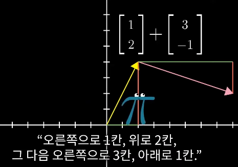

# Essence of linear algebra(선형대수학의 본질)
> https://youtu.be/ArgTeYVuJUo?si=5n7xFZlwzQ2B43eY
## 1장: 벡터란 무엇인가?
### 벡터를 바라보는 3가지 관점
#### 물리학의 관점
"공간 상의 한 화살표"

벡터는 그 길이와 그것이 가리키는 방향으로 정의된다. 길이와 방향이 같다면 어디에 두더라도 같은 벡터로 취급한다.
#### 컴퓨터 과학의 관점
"숫자 자료를 배열한 것"

벡터란 단지 배열을 멋들어지게 표현한 것. 그냥 배열이라는 소리임.

#### 수학자의 관점
"위 두 견해를 모두 일반화 하려함"

벡터는 그 길이와 그것이 가리키는 방향으로 정의된다. 길이와 방향이 같다면 어디에 두더라도 같은 벡터로 취급한다.

## 벡터 덧셈의 시각적 해석
와우. 지금까지 아무생각 없이 벡터를 더할때 삼각형법으로 했는데 "원점에서 각 벡터 방향과 크기대로 이동한 결과"라고 생각하니 직관적으로 이해가 된다.

## 벡터 상수배의 시각적 해석

Scaling: 벡터의 방향은 유지한 채 그 길이를 늘이고 줄이고 뒤집는 등의 과정
Scalar: 벡터를 스케일하는 숫자. 선형대수학에서 숫자들의 주된 역할이 벡터를 스케일하는 것이라서 스칼라를 숫자와 같은 의미로 사용하기도 한다.