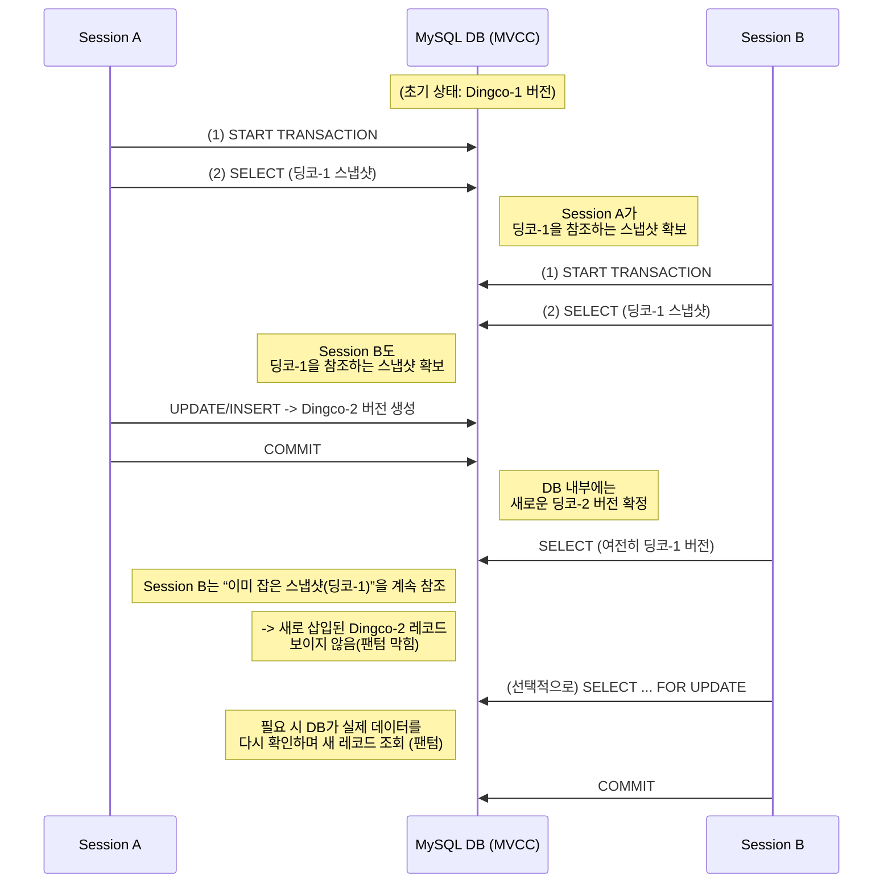

## 실제로 어떻게 일어나는 걸까?
- 트랜잭션 일어나는 것 알기위해서는 디비에서 어떤식으로 데이터를 저장하는지를 알아봐야한다
- 디비가 커밋된 **데이터를 반드시 보장해야 한다(지속성, Durability)**는 사실을 알고 있음
	- 그래서 단순히 변경된 데이터를 바로 디스크에 저장하면 된다고 생각할 수 있지만 이러면 문제가 생김!
- 디스크는 I/O 속도가 느리다
	- 따라서, 첫머리 찾는 시간이 오래 걸림. 대량의 데이터를 즉시 저장하면 커밋 시간이 너무 길어짐. 
	- 처리속도가 느려지면 동시 요청을 처리하는 성능이 크게 떨어지게 됨
- 그래서 RDBMS는 ==WAL(Write-Ahead Logging)==이라는 것 사용
	- 데이터를 직접 디스크에 쓰는게 아니라, '변경 사항을 빠르게 기록하고 나중에 반영하는 방식'
- READ LOG
	- UPDATE 실행 -> 디스크에 바로 반영 않고, REDO LOG에 기록
	- COMMIT 실행 -> REDO LOG 보고 디스크에 정식 반영
	- 만약 시스템이 갑자기 다운되는 경우? -> REDO LOG보고 다시 데이터 복구 가능!
- UNDO LOG
	- UPDATE 실행 -> 기존 데이터를 UNDO LOG(백업본)로 저장
	- ROLLBACK 실행 -> UNDO LOG 보고 원복
	- COMMIT 실행 -> UNDO LOG 필요 없어지므로 삭제
> 정리
> REDO LOG: 포스트잇 같음. 회의 내용 빠르게 적고, 나중에 정식으로 정리
> UNDO LOG: 백업본 저장 같음. 실수할 경우 원복가능

|          | REDO LOG           | UNDO LOG                    |
| -------- | ------------------ | --------------------------- |
| 비유       | 회의 중 중요내용 빠르게 적음   | 노트 초안을 저장하여 실수하면 되돌림        |
| 목적       | 시스템 장애 발생 시 데이터 복구 | 트랜잭션 취소 시 원래 상태 복구          |
| 저장하는 데이터 | 어떤 데이터를 어떻게 변경했는가? | 변경 전 데이터를 원래 상태로 되돌리기 위한 기록 |
| 삭제 시점    | 데이터 파일 반영 후 삭제     | 트랜잭션이 COMMIT 되면 삭제          |
## 격리성 레벨과 관계
- 우리는 트랜잭션 격리성이 어케 동작하는지, 그리고 InnoDB에서 REDO LOG & UNDO LOG가 어떤 역할하는지 배웠음.
- 그럼 이 두가지가 어케 연결될까?
- 격리성 레벨 유지하는 핵심은 UNDO LOG, REDO LOG 를 적절히 활용하는 것!!!
### READ UNCOMMITTED
- 트랜잭션이 수정한 데이터를 즉시 반영하는 방식
- 다른 트랜잭션도 커밋되지 않은 변경사항을 볼 수 있게됨
- REDO LOG를 볼 수 있구나! 로 이해
1. Tx A가 트랜잭션 시작하고 변경을 함. REDO LOG 에 데이터 쌓임
2. TX B에서는 그 REDO LOG 보고 데이터 변경을 감지

###  READ COMMITTED
- 커밋된 최신 데이터를 보여주는 격리 수준
- 트랜잭션이 조회할 때마다 최신 COMMIT된 데이터를 가져와야됨
- UNDO LOG 가 중요한 역할
1. 트랜잭션 갑에서 데이터 수정하면 변경 전 데이터를 UNDO LOG 에 저장
2. 트랜잭션 을에서 데이터를 조회하려 할 때, 아직 트랜잭션 갑이 COMMIT 되지 않았다면? -> 을은 UNDO LOG에서 기존 데이터 조회함
3. 만약 갑이 COMMIT 되면? -> 을은 커밋된 최신데이터 읽게됨
### REPEATABLE READ
- 트랜잭션이 끝날 때까지 동일한 데이터 조회하도록 보장하는 격리 수준
- 이를 위해 트랜잭션 시작될 때, UNDO LOG의 데이터를 유지하면서 같은 결과를 반환
	- 즉, UNDO LOG활용하여 "처음 조회한 데이터를 계속 유지"하는 것
1. 갑이 SELECT 실행하면, 해당 시점의 데이터를 UNDO LOG에 저장.
2. 이후 갑에서는 다시 같은 데이터 조회해도, UNDO LOG에서 조회된 동일한 결과 반환
3. 심지어 을에서 데이터 변경 후 COMMIT 하더라도, 현재 트랜잭션(갑)은 여전히 UNDO LOG에서 과거 데이터 조회함!
### SERIALIZABLE
- 가장 강력 격리 수단
- 완벽한 데이터 정합성 보장
- UNDO LOG 만으로는 완벽한 직렬화 불가
	- 그래서, LOCK을 추가로 사용하여 모든 트랜잭션을 한 줄로 세움
1. 갑이 SELECT하면, 해당 데이터에 락이 걸림
2. 을이 동일한 데이터 수정하려 하면, 락이 풀릴때까지 기다려야함
## 그럼 REPEATABLE READ는 어떻게 구현된거지?
- REPEATABLE READ는 처음 조회한 데이터를 트랜잭션 끝날때까지 유지해햐함.
- 하지만, 다른 트랜잭션에서 데이터 변경할수도 있는데? 그러면 어떻게 처음 조회한 데이터를 유지 가능?
	- UNDO LOG
- 각 트랜잭션이 데이터 조회하는 순간의 값을 UNDO LOG에 "독립적으로 유지"해야함
- 즉, 각각의 트랜잭션에서 각 버젼으로 데이터가 존재!

**이렇게 각 트랜잭션이 자신만의 독립적 데이터 버전 유지할 수 있도록하는 기술이 바로, [[MVCC]], 다중 버전 동시성 제어라고도 부름!**

그러나, 만약 너무 트랜잭션이 많아진다면? 무수한 버젼의 데이터 생기게되어 UNDO LOG가 쌓이고, 트랜잭션이 길어질 수록 메모리와 저장 공간 부담이 커짐

따라서, 긴 트랜잭션 방지하고, 짧은 트랜잭션을 사용해야함

- 특히, 대량 삭제(DELETE) 작업이 많다면 UNDO LOG가 급격히 증가할 수 있음
- 읽기(READ)에서는 성능이 좋지만, 많은 변경(UPDATE, DELETE) 발생때는 UNDO LOG관리가 필요함

---
자 딩코 예제로 이해해보자
1. 세션 가, 나가 동시에 트잭 시작. 이때 버전-1 존재. 두 세션은 동시에 버전-1 기준 데이터를 스냅샷 형태로 가지고 옴. 즉, 각 세션은 트잭 시작 시점(혹은 첫 SELECT 시점)에 버전-1을 기준으로한 일관된(Read View) 스냅샷을 만든다 볼 수 있음
2. 세션 가가 새로운 데이터 삽입. 가가 INSERT or UPDATE하면, 디비 내부적으로는 버전-2같은 새로운 버전으로 기록됨. 이 새로운 버전은 세션 가에서는 보이지만, 세션 나의 관점에서는 아직 해당 버전 볼 필요없는 상태(스냅샷 밖)로 간주
3. 세션 나가 조회할 때 세션 비는 트잭 시작때 만든 스냅샷을 일관되게 유지. 따라서 조회시 버전-1만 계속 조회. 이렇게 중간에 생성된 새 버전 안보고 본인꺼만 보는게 MySQL REPEATABLE READ, MVCC의 핵심입니다
4. 하지만 세션 을이 FOR UPDATE로 조회할때는 디비 기준으로 현재 디비에 반영된 값 기준으로 락을 검. 따라서 특정 조건(부분 범위 검색, for update등)에선 MVCC가 새로 삽입된 레코드 보여주어 [[Phantom Read]]팬텀 리드가 발생함!

### 정리
1. **트랜잭션이 시작되거나(또는 첫 SELECT 시)** InnoDB는 Consistent Read View(스냅샷)를 만든다.
2. 이후 같은 트랜잭션 내에서 **이미 읽은 레코드**는 **처음 본 버전**을 유지하므로, *Non-repeatable Read* 문제가 해결된다.
3. 새로 INSERT된 레코드(딩코-2 등)에 대해서는, 스냅샷 판별(인덱스 범위, `FOR UPDATE` 사용 여부)에 따라
    - **안 보이기도** 해서 *팬텀 리드가 막히거나*,
    - **보이기도** 해서 *실제로 팬텀 리드가 발생*할 수도 있다.
4. 결과적으로, MySQL(InnoDB)은 MVCC를 통해 **대부분의 팬텀·Non-repeatable Read를 완화**하지만, **완전 차단**을 원한다면 추가로 **락(`SELECT ... FOR UPDATE`)** 등을 활용해야 한다.